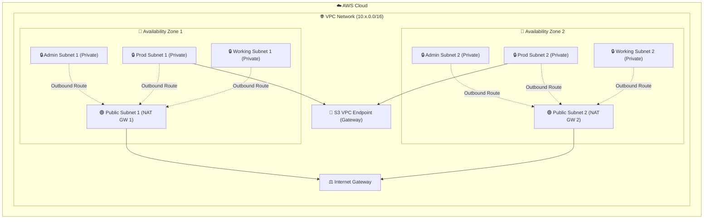

# AWS VPC Terraform Infrastructure Module


A highly configurable and secure Terraform module designed to provision a standard, production-ready **AWS Virtual Private Cloud (VPC)** network topology across multiple Availability Zones.

---

## 📐 Network Architecture Topology

The diagram below details the subnets structure, routing paths, and gateways created across different Availability Zones (AZs) by this module:



---

## 📂 Repository Submodules

* **Root Module (`.`)**: Main entrypoint. Allocates dynamic subnets inside VPC, provides support for single/multi AZ NAT Gateways setup, and configures S3 VPC Gateway Endpoints to route S3 traffic securely without using NAT Gateways.
* **`modules/` (Custom Submodule)**: A secondary modular VPC setup optimized for GKE/K8s nodes deployments with configurable availability zones counts, custom CIDR lists, and dynamic subnets association.

---

## 🛠️ Usage Example

Include this module in your root Terraform configuration:

```terraform
module "vpc" {
  source                     = "git::https://github.com/Andreichenko/module-tf-aws-vpc.git?ref=v1.0.0"
  aws_region                 = "us-east-1"
  aws_vpc_name               = "production-vpc"
  az_count                   = 3
  
  vpc_cidr_base              = "10.20" # Generates a 10.20.0.0/16 VPC
  single_nat_gateway         = 1       # Use a single NAT gateway to reduce AWS cost
  enable_s3_vpc_endpoint     = true    # Route AWS S3 traffic privately
  
  global_tags = {
    Environment = "production"
    ManagedBy   = "Terraform"
  }
}
```

---

## ⚙️ Inputs Configuration Reference

| Name | Description | Type | Default | Required |
|------|-------------|------|---------|:--------:|
| `aws_region` | AWS target region | `string` | n/a | **yes** |
| `aws_vpc_name` | The Name tag assigned to the VPC | `string` | `"vpc"` | no |
| `az_count` | Number of active availability zones in VPC | `string` | `"3"` | no |
| `vpc_cidr_base` | The base CIDR prefix (e.g. `10.20` for `10.20.0.0/16`) | `string` | `"10.20"` | no |
| `single_nat_gateway` | If `1`, provisions a single shared NAT Gateway for private subnets | `number` | `0` | no |
| `multi_az_nat_gateway` | If `1`, places a NAT gateway in each Availability Zone | `number` | `1` | no |
| `enable_s3_vpc_endpoint` | Create a S3 gateway endpoint and private route entries | `string` | `"false"` | no |
| `global_tags` | AWS tags that will be appended to all resources | `map(string)` | `{"Managed By": "Terraform"}` | no |

---

## 🛡️ CI/CD Validation
This repository has an active GitHub Actions workflow configured in `.github/workflows/validate.yml`. Upon every push to the `master` branch or pull requests, it automatically validates the configuration using Terraform version `1.5.7` for both the Root and the `modules/` submodule to prevent syntax and compile errors.
